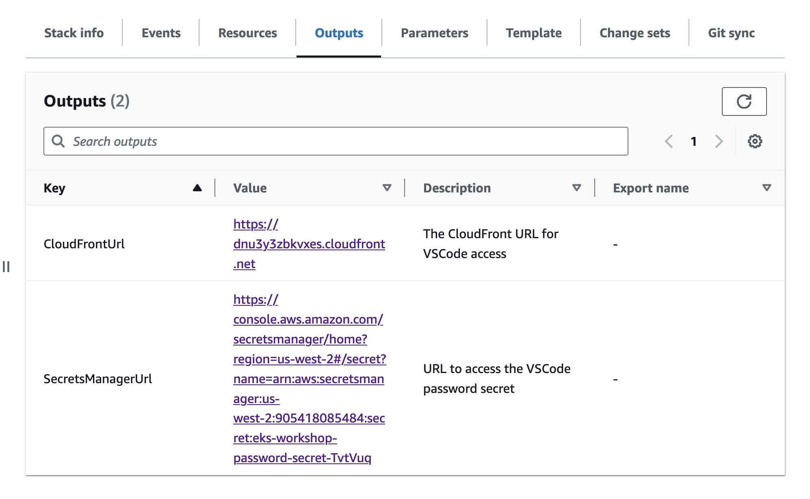

# CloudLabIDE

This repository contains CloudFormation templates to quickly set up VSCode (code-server) instances in us-east-1 and us-west-2 regions. Templates are pre-configured with necessary permissions and are ready to be used for cloud security-related workshops or development.

> [**Authored by:** Anjali Singh Shukla & Divyanshu Shukla](https://peachycloudsecurity.com/about)

## Security Notice

> **⚠️ IMPORTANT:** These templates store VSCode passwords in **plain text** in the code-server configuration file. This is acceptable for **lab and training environments only** and is **NOT recommended for production use**. 


---

## Quick-Launch Links

> [Credit: AWS Eksworkshop](https://www.eksworkshop.com/docs/introduction/setup/your-account/)

Use the AWS CloudFormation quick-create links below to launch the desired environment in your preferred AWS region.

| Region         | OS Type        | VSCode            | AI IDE (c6i.2xlarge)  |
|----------------|----------------|---------------------------------------|---------------------------------------|
| **us-east-1**  | Amazon Linux   | [Launch](https://console.aws.amazon.com/cloudformation/home?region=us-east-1#/stacks/quickcreate?stackName=peachycloudsecurity-al2023-useast1&templateURL=https://peachycloudsecurity-vscode.s3.us-west-2.amazonaws.com/vscode-al2023-us-east-1.yml)  | |
| **us-east-1**  | Ubuntu 22.04   | [Launch](https://console.aws.amazon.com/cloudformation/home?region=us-east-1#/stacks/quickcreate?stackName=peachycloudsecurity-ubuntu2204-useast1&templateURL=https://peachycloudsecurity-vscode.s3.us-west-2.amazonaws.com/vscode-ubuntu2204-us-east-1.yml) | |
| **us-west-2**  | Amazon Linux   | [Launch](https://console.aws.amazon.com/cloudformation/home?region=us-west-2#/stacks/quickcreate?stackName=peachycloudsecurity-al2023-uswest2&templateURL=https://peachycloudsecurity-vscode.s3.us-west-2.amazonaws.com/vscode-al2023-us-west-2.yml) | [Launch](https://console.aws.amazon.com/cloudformation/home?region=us-west-2#/stacks/quickcreate?stackName=peachycloudsec-al2023-uswest2-ai&templateURL=https://peachycloudsecurity-vscode.s3.us-west-2.amazonaws.com/ai-al2023-us-west-2.yml) |
| **us-west-2**  | Ubuntu 22.04   | [Launch](https://console.aws.amazon.com/cloudformation/home?region=us-west-2#/stacks/quickcreate?stackName=peachycloudsecurity-ubuntu2204-uswest2&templateURL=https://peachycloudsecurity-vscode.s3.us-west-2.amazonaws.com/vscode-ubuntu2204-us-west-2.yml) | [Launch](https://console.aws.amazon.com/cloudformation/home?region=us-west-2#/stacks/quickcreate?stackName=peachycloudsec-ubuntu2204-uswest2-ai&templateURL=https://peachycloudsecurity-vscode.s3.us-west-2.amazonaws.com/ai-ubuntu2204-us-west-2.yml) |

### Required AWS Permissions

The IAM user/role deploying this stack requires the following permissions:

```json
{
  "Version": "2012-10-17",
  "Statement": [
    {
      "Effect": "Allow",
      "Action": [
        "cloudformation:CreateStack",
        "cloudformation:DeleteStack",
        "cloudformation:DescribeStacks",
        "cloudformation:UpdateStack",
        "ec2:*",
        "iam:CreateRole",
        "iam:DeleteRole",
        "iam:AttachRolePolicy",
        "iam:DetachRolePolicy",
        "iam:PutRolePolicy",
        "iam:DeleteRolePolicy",
        "iam:CreateInstanceProfile",
        "iam:DeleteInstanceProfile",
        "iam:AddRoleToInstanceProfile",
        "iam:RemoveRoleFromInstanceProfile",
        "iam:PassRole",
        "secretsmanager:CreateSecret",
        "secretsmanager:DeleteSecret",
        "secretsmanager:DescribeSecret",
        "secretsmanager:GetSecretValue",
        "cloudfront:CreateDistribution",
        "cloudfront:DeleteDistribution",
        "cloudfront:GetDistribution",
        "cloudfront:UpdateDistribution"
      ],
      "Resource": "*"
    }
  ]
}
```

**Note:** For production environments, restrict `Resource: "*"` to specific ARNs. The stack uses `AdministratorAccess` policy for the EC2 instance role to facilitate workshop activities.

### Setup Instructions

1. **Choose your Region and OS**: Use the table above to pick your region and OS type, then launch the CloudFormation stack.

2. **Monitor the Stack Creation**: The stack will take about 10 minutes to complete.

3. **Access the CloudFormation Outputs**: Once the stack creation is complete, retrieve the outputs.

    - CloudFrontUrl
        - To access the cloudFront url for the VSCode access
    - SecretsManagerUrl
        - Retrieve the secret to access the VSCode IDE.


    
5. Access the `CloudFrontUrl` & follow next steps from [terraform-eks](https://github.com/kubernetesvillage/terraform-eks) to deploy `eks cluster`.

### Cleanup

To avoid unnecessary costs, be sure to delete the CloudFormation stacks and any created AWS resources once you're finished.

- To delete the VSCode instance, run the following command:

    ```bash
    aws cloudformation delete-stack --stack-name securitydojo-eks-workshop
    ```

- Follow the cleanup instructions for the EKS resources, either through `eksctl` or Terraform.


## Disclaimer

- The views expressed are solely those of the speaker and do not reflect the opinions of the employer. Use at your own risk.
- The password is temporary and regenerates each time the script runs.
- Do not push this code while the VS Code server is running.
- The employer or employee is not responsible for any charges or security issues that may arise. Also views are personal
- This project is licensed under the GPL-3.0 license. See the [LICENSE](LICENSE) file for details.
- This repository uses code from the [AWS EKS Workshop](https://github.com/aws-samples/eks-workshop-v2/), licensed under the Apache-2.0.

## Credits


- The CloudFormation templates have been adapted for use in the **peachycloudsecurity** EKS workshop.
- [AWS-Samples](https://github.com/aws-samples/eks-workshop-v2/) under the [Apache-2.0 license](https://github.com/aws-samples/eks-workshop-v2/?tab=Apache-2.0-1-ov-file#readme)
- Thanks to [coder team](https://github.com/coder/deploy-code-server)
- Thanks to [AWS eks-workshop-v2](https://github.com/aws-samples/eks-workshop-v2/blob/main/lab/scripts/installer.sh)


This project is maintained by the peachycloudsecurity. Contributions are welcome!

For more information, visit our [website](https://peachycloudsecurity.com/).

## Peachycloud Security

Hands-On Multi-Cloud & Cloud-Native Security Education

Created by The Shukla Duo (Anjali & Divyanshu), this tool is part of our mission to make cloud security accessible through practical, hands-on learning. We specialize in AWS, GCP, Kubernetes security, and DevSecOps practices.

### Learn & Grow

Explore our educational content and training programs:

[YouTube Channel](https://www.youtube.com/@peachycloudsecurity) | [Website](https://peachycloudsecurity.com) | [1:1 Consultations](https://topmate.io/peachycloudsecurity)

Learn cloud security through hands-on labs, real-world scenarios, and practical tutorials covering GCP & AWS, GKE & EKS, Kubernetes, Containers, DevSecOps, and Threat Modeling.

### Support Our Work

If this tool helps you secure your infrastructure, consider supporting our educational mission:

[Sponsor on GitHub](https://github.com/sponsors/peachycloudsecurity)

Your support helps us create more free educational content and security tools for the community.

